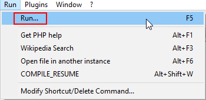
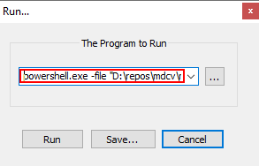
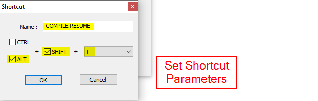

# mdcv

## Purpose

This is simply a repository to track any changes that I make to my print resume. It is written in LaTeX and I compile it into a PDF whenever I want to make changes to it.

This repository was originally used for versioning a resume from Markdown, but I've since scrapped that and re-written the entire thing as a LaTeX doc. 

## Compile

 * Linux (uses a Makefile)
	- To build this on linux, pull the repo down locally and ensure that pdflatex is installed.
	- Run make all && make-keep-pdf

 * Windows (uses a Powershell script)
	- To build this on your windows machine, pull the repo down locally and ensure that pdflatex and SumatraPDF are installed.
	- In a powershell session, run this invocation in the resume directory: _make_resume.ps1 "N"_

### Setup Notepad++ Shortcut
 _these are really just notes for myself for when I inevitably have to setup another Notepad++ shortcut_
 
	1. Select Run from the toolbar (or strike F5) 
		* 
	2. Input the following one-liner, giving the path where the .ps1 script is located:
		* ```powershell.exe -file "D:\repos\mdcv\make-resume.ps1"```
		*
	3. Set Shortcut Parameters (including keystrokes)
		* 